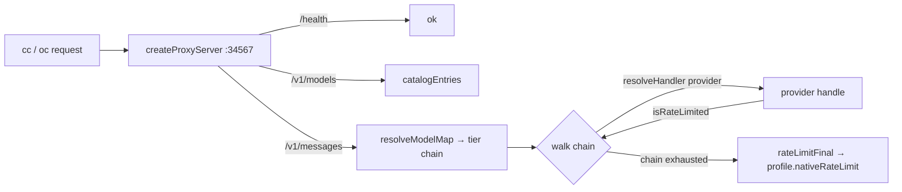

# core-proxy

The shared routing + HTTP-proxy engine for the intisy AI-tooling ecosystem. It
holds the `:34567` daemon logic (tier→provider routing chains, rate-limit
fallback, model rewrite, the native-429 synthesis, and the node↔web request
adapter) as a single source of truth, so both the loaders and the dashboard
sidecar drive identical behavior.

This is a **library repo consumed as a git submodule and bundled from source**
(the same treatment as `core` / `core-auth` / `core-loader`) — it is not
published to npm.

## Under-the-Hood Architecture



Routing is parameterized by a `RoutingProfile`: everything Claude-specific
(config filename, routing key, tier order/fallback, tier regex, env prefix,
default context/output limits, and the native rate-limit response) lives in a
profile, so a non-Anthropic host (e.g. OpenCode) can supply its own without
forking the engine.

## Structure

- `src/types.ts` — the ABI (`HandlerCtx`, `ProxyHandler`, `HandlerResolver`,
  `Assignment`, `Chain`, `ModelMap`, `CatalogEntry`, `RateLimitInfo`,
  `RoutingProfile`, `ProxyOptions`, `ProxyServer`) + `isValidProfile`.
- `src/rate-limit.ts` — `isRateLimited`, `rateLimitResetMs`, `rateLimitFinal`.
- `src/model-map.ts` — `resolveModelMap`, `claudeTiers`, `readModelMap`,
  `catalogEntries`, `normalizeChain`, `modelEnvPairs`.
- `src/handler-resolver.ts` — `makeDynamicResolver` (mtime-cache-busting
  dynamic import of provider handlers, provider list injected).
- `src/server.ts` — `createProxyServer(opts)` (the daemon + node↔web adapter).
- `src/profiles/anthropic.ts` — `anthropicProfile(overrides?)`.
- `src/index.ts` — the public barrel.
- `dist/` — compiled output (gitignored, never committed).

## Usage

```ts
import { createProxyServer, anthropicProfile, makeDynamicResolver } from "../core-proxy/src/index.js";

const resolveHandler = makeDynamicResolver(() =>
  readDeployedProviders(reposDir).map((p) => ({ provider: p.provider, handlerPath: p.handlerPath }))
);
const server = createProxyServer({ configDir, profile: anthropicProfile(), port: 34567, resolveHandler });
await server.listen();
```

## Testing

`npm run build && npx vitest run` — unit tests for each module plus an
integration test that binds an ephemeral port and exercises `/health`,
chain fallback past a rate-limited provider, and native-429 exhaustion.

## License

MIT
